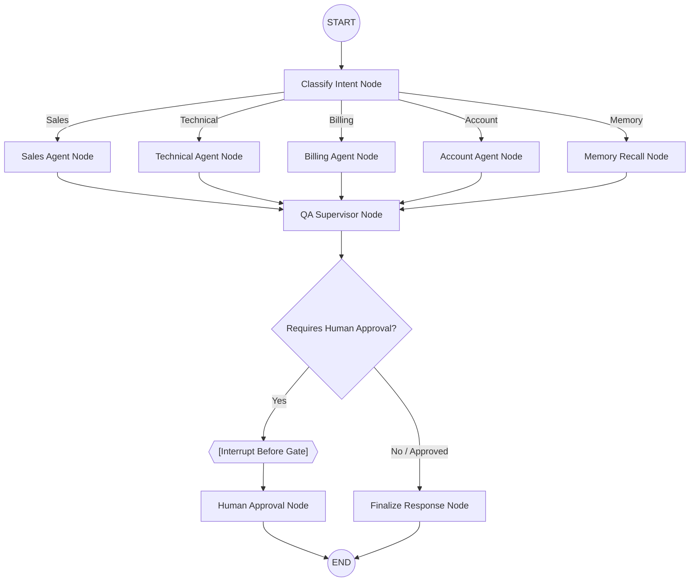

# AI-Powered Customer Support Automation System

An enterprise-grade Customer Support Automation backend built using **LangGraph**, local **Ollama models** (`llama3.2` and `nomic-embed-text`), and a **SQLite checkpoint memory connection**. The system classifies user query intent, queries a local RAG pipeline, routes tasks to specialized support agents, validates responses with a QA Supervisor, and enforces a human-in-the-loop interrupt gate for high-risk requests.

---

## 🚀 Key Features

*   **Intent Classifier Node**: Routes queries into *Sales*, *Technical*, *Billing*, *Account*, or *Memory* categories.
*   **Specialized Agents**: Division of labor between Sales, Technical, Billing, and Account agents.
*   **Local RAG Integration**: Automatically retrieves context from company policies, pricing plans, and FAQs using local embeddings and cosine similarity.
*   **QA Supervisor Agent**: Validates and improves agent draft responses against company policies and correctness before they reach the user.
*   **Human-in-the-Loop Interrupts**: Pauses graph execution on high-risk queries (e.g. refund requests, cancellations) to require supervisor approval.
*   **Persistent SQLite Memory**: Stores conversation states across runs, enabling memory recall queries to retrieve past thread history.

---

## 🗺️ System Architecture



---

## 📁 Directory Structure

```text
├── knowledge_base/               # Knowledge base source documents
│   ├── company_policy.txt        # Refund and cancellation policies
│   ├── pricing_guide.txt         # Sales pricing tiers and limitations
│   ├── technical_manual.txt      # Troubleshooting steps and guidelines
│   ├── faq.txt                   # Standalone Q&A database
│   └── embeddings_cache.json     # Saved embedding vectors to optimize execution
├── customer_support_system.py    # Main LangGraph python execution script
├── requirements.txt              # Project library dependencies
├── support_memory.db             # SQLite checkpoint database
└── workflow_diagram.png          # Flowchart of the LangGraph architecture
```

---

## 🛠️ Prerequisites & Setup

### 1. Install Python 3.10+
Ensure Python is installed on your machine. You can verify it with:
```bash
python --version
```

### 2. Set Up Ollama
1. Download and install [Ollama](https://ollama.com) on your system.
2. Run the Ollama service.
3. Download the text and embedding models in your terminal:
   ```bash
   ollama pull llama3.2:latest
   ollama pull nomic-embed-text:latest
   ```

### 3. Install Dependencies
Navigate to the project workspace directory and run:
```bash
pip install -r requirements.txt
```

---

## 🏃 Run Instructions

You can execute the system in two different modes:

### A. Run Automated Demo
To run the automated test suite demonstrating the 5 sample user queries (Pricing, Password Reset, App Crash, Refund Request, and Memory Recall) on a clean database slate:
```bash
python customer_support_system.py --demo
```
This runs the entire system non-interactively, demonstrating the intent classification, RAG lookup, supervisor QA audit, human-in-the-loop approval simulation, and SQLite-backed memory recall.

### B. Run Interactive CLI Session
To start an interactive support session where you can chat with the assistant and test persistence:
```bash
python customer_support_system.py
```
1. You will be prompted to enter your name (e.g. `David`).
2. The CLI will establish a thread session named `thread_david`.
3. Try asking: `My name is David. I have a billing issue.`
4. Follow up with: `What was my previous support issue?` (The system will fetch your thread state from the SQLite database and summarize the previous chat context!).
5. Type `exit` or `quit` to end the session.
